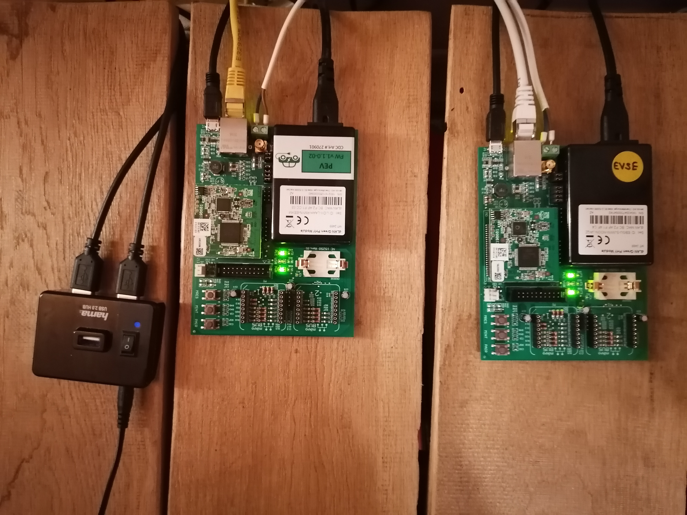

# Implementierung des ISO-15118 fuer Devolo_dLan_GreenPHY eval Boards

## Inhalt

[[_TOC_]]

## Setup

Anbei sind die Schritte beschrieben, um die Testumgebung mit den beiden GreenPHY
Eval Boards zum Laufen zu bekommen.

### Eval-Boards

Anschluss der Kabel folgendem Bild bzw. der Anleitung entnehmen (links PEV,
rechts EVSE):


* Stromversorgung ueber Micro-USB Anschluss (hier ueber USB-Hub betrieben)
* es gibt 3 Moeglichkeiten, wie zwei eval boards untereinander kommunizieren
  koennen, abhaengig ist dies davon, wie die Jumper JC6, JC7 und JC8 belegt sind:
  * (*JC8 geschlossen, JC7 offen*) Powerline-Anschluss (AC-Line) beider Boards an **gleicher** Mehrfachsteckdosenleiste
    * (*JC7 geschlossen, JC8 offen, JC6 offen fuer 100W impendanz*) beide Boards ueber Twisted-Pair-Anschluss verbunden (gruener Stecker), Belegung jeweils:
      * links blaues Kabel
        * rechts braunes Kabel
    * (*JC7 geschlossen, JC8 offen, JC6 geschlossen fuer 50W impendanz*) Koax-Kabel
* Kommunikation zum Host (Entwicklungsrechner) ueber Ethernet

### Host-System

* open-plc-utils installieren
  * fuer Arch-Linux als AUR-Package
  * andernfalls suchen oder von [GitHub](https://github.com/qca/open-plc-utils)
    beziehen

### RISE V2G Open Source Implementierung

* Download des [GitHub Repos](https://github.com/V2GClarity/RISE-V2G)
* RISE-V2G-SHARED/pom.xml anpassen:
  * folgendes unter `<dependencies>` einfuegen:

 ```XML
 <dependency>
   <groupId>javax.xml.bind</groupId>
   <artifactId>jaxb-api</artifactId>
   <version>2.3.1</version>
  </dependency>
 <dependency>
   <groupId>org.glassfish.jaxb</groupId>
   <artifactId>jaxb-runtime</artifactId>
   <version>2.3.1</version>
   <scope>runtime</scope>
  </dependency>
 ```

* die javax.xml.bind dependencies wurden im JDK Version > 8 entfernt und
      muessen so nachtraeglich installiert werden
* maven-dependancies laden und das Projekt bauen
* EVCC/SECC Config siehe [Netzwerk-Interface bestimmen](#netzwerk-interface-bestimmen)
* zum ersten Testen:
  * StartEVCC ausfuehren (RISE-V2G-EVCC > src > main >
      com.v2gclarity.risev2g.evcc > main)
  * StartSECC ausfuehren (RISE-V2G-SECC > analog zu oben )

## Kommunikation zwischen Host und Eval Boards

Die Eval-Boards haben eine Atheros QCA7000 Chip und koennen ueber die, durch
open-plc-utils mitgelierferten, Programme und Skripte angesprochen und gesteuert
werden.
> Hinweis: Statt wie in der open-plc Doku verwendeten int6k.. Programme die
> pcltool.. Programme fuer den neueren QCA7000 Chip verwenden

Die Boards sind bereits vorkonfiguriert und entsprechend geflasht.
Vorbelegten MACs und entsprechende Ethernet-Interfaces (auf dem Host-System):

* EVSE: BC:F2:AF:F1:4F:C4 (Ethernet-Interface: enp0s20f0u2u4)
* PEV:  BC:F2:AF:F1:CC:03 (Ethernet-Interface: enp0s20f0u3u1)

### Erste Verbindungs und Statusabfrage

* **plctool -m**: Netzwerk-Config abfragen
  * `network->STATIONS = 1` zeigt, dass das Board ueber Powerline mit einem
    Netzwerk Verbindung aufgebaut hat, was auch aus der Ãœbertragungsrate > 0
    deutlich wird
* **plctool -r**: Firmware und Hardware Infos abfragen
* **plctool -I**: Den PBI-Header auslesen
  * *DAK*: Device Access Key (fuer jedes Board individuell)
  * *NMK*: Network membership key (muss fuer beide gleich sein, um einem Netzwerk
    zugeordnet zu sein)

```shell
> plctool -m -i enp0s20f0u2u4
enp0s20f0u2u4 00:B0:52:00:00:01 Fetch Network Information
enp0s20f0u2u4 BC:F2:AF:F1:4F:C4 Found 1 Network(s)

source address = BC:F2:AF:F1:4F:C4

 network->NID = B0:F2:E6:95:66:6B:03
 network->SNID = 11
 network->TEI = 1
 network->ROLE = 0x02 (CCO)
 network->CCO_DA = BC:F2:AF:F1:4F:C4
 network->CCO_TEI = 1
 network->STATIONS = 1

  station->MAC = BC:F2:AF:F1:CC:03
  station->TEI = 2
  station->BDA = 00:50:B6:B8:46:D5
  station->AvgPHYDR_TX = 009 mbps Primary
  station->AvgPHYDR_RX = 009 mbps Primary

> plctool -r -i enp0s20f0u2u4
enp0s20f0u2u4 00:B0:52:00:00:01 Request Version Information
enp0s20f0u2u4 BC:F2:AF:F1:4F:C4 QCA7000 MAC-QCA7000-1.1.0.727-02-20130826-FINAL
> plctool -I -i enp0s20f0u2u4
 PIB 0-0 8080 bytes
 MAC BC:F2:AF:F1:4F:C4
 DAK D7:EA:8D:81:1A:95:44:53:B3:EA:62:4E:69:C1:7C:17
 NMK 50:D3:E4:93:3F:85:5B:70:40:78:4D:F8:15:AA:8D:B7 (HomePlugAV)
 NID B0:F2:E6:95:66:6B:03
 Security level 0
 NET Qualcomm Atheros Enabled Network
 MFG Devolo_dLan_GreenPHY
 USR SLAC-EVSE
 CCo Always
 MDU N/A
```

### NMK neu setzen

Sollte der Network Membership Key (NMK) eines der Boards veraendert worden sein,
kann dieser mittels folgendem Befehl neu gesetzt werden:
(anzupassen sind jeweils Ethernet-Interface, MAC-Adresse und NMK des anderen
Boards, zu welchem Netzwerk man sich verbinden moechte)

```shell
plctool -i eth1 -p settings.pib BC:F2:AF:F1:CC:03 && \
      modpib -N FA:6C:AC:B4:BB:66:42:95:EC:E6:9F:20:E5:7F:87:23 -v settings.pib && \
      plctool -i eth1 -P settings.pib BC:F2:AF:F1:CC:03
```

---

## Implementierung

Diese ISO-15118 Implementierung baut auf der Referenz-Implementierung [RISE-V2G](https://github.com/V2GClarity/RISE-V2G) von Dr. Marc Mueltin auf. Das Repository wurde um eine REST Schnittstelle und deren Integration in RISE V2G erweitert, um den ISO-15118 in der Laborumgebung der HSRM einbinden zu koennen. Die REST Schnittstelle wurde nach der [OpenAPI Specification](https://spec.openapis.org/oas/v3.0.3) entwickelt.

### Bestandteile

Das RISE V2G Repo besteht zunaechst aus 5 Ordnern:

* **Certificates**: Hier liegen die Zertifikate der Entwicklungsumgebung
* **EVCC**: Der EVCC Client Code (wird hier nur zum Testen gebraucht, uebernimmt ansonsten das PEV)
* **PARENT**: Uebergeordnetes Projekt in der IDE
* **SECC**: Die Implementierung der Wallbox-Seite (der spannende Teil dieser Arbeit)
* **Shared**: Gemeinsame Packete der EVCC und SECC Implementierung

Darueber hinaus liegen im Root-Folder des Repos noch die Dateien *EVCCConfig.properties* und *SECCConfig.properties* in welchem allgemeine Einstellungen der ISO Implementierung hinterlegt sind. Das sind z.B.:

* Netzwerk-Interface der Powerline Kommunikation
  * **Achtung!**: Diese Einstellung ist abhaengig von der jeweiligen Hardware welche den SECC-Server ausfuehrt. Unter Linux ist der Default *eth0* unter Windows *6*. Siehe mehr dazu unter [Netzwerk-Interface bestimmen](#netzwerk-interface-bestimmen)
* Unterstuetzte Lade-Modi (bspw. AC dreiphasig, DC einphasig, usw.)
* kostenloses Laden oder bezahl Laden
* Einstellung bzgl. des EXI Codecs und des Umfangs des Loggings der EXI Daten

#### Netzwerk-Interface bestimmen

##### Linux

Je nach installierten Paketen einer der folgenden Befehle in der Konsole ausfuehren. Das Paket *ifconfig* ist inzwischen veraltet und nicht immer als default installiert.

```bash
ifconfig -a | grep Link
```

```bash
ip link show
```


Hier ist das Netzwerk-Interface z.B.: **enp0s3**

##### Windows

Unter Windows ist nicht der Name des Interfaces sondern dessen Index anzugeben. Der folgende Befehl in *PowerShell* produziert z.B. untenstehenden Output.

```sh
Get-NetIPInterface
```

```sh
ifIndex InterfaceAlias                  AddressFamily NlMtu(Bytes) InterfaceMetric Dhcp     ConnectionState PolicyStore
------- --------------                  ------------- ------------ --------------- ----     --------------- -----------
5       Ethernet 3                      IPv6                  1350              25 Enabled  Disconnected    ActiveStore
13      Ethernet 2                      IPv6                  1500              35 Enabled  Connected       ActiveStore
6       OpenVPN TAP-Windows6            IPv6                  1500              25 Enabled  Disconnected    ActiveStore
7       Ethernet                        IPv6                  1500               5 Enabled  Disconnected    ActiveStore
9       OpenVPN Wintun                  IPv6                 65535               5 Disabled Disconnected    ActiveStore
1       Loopback Pseudo-Interface 1     IPv6            4294967295              75 Disabled Connected       ActiveStore
5       Ethernet 3                      IPv4                  1350              25 Enabled  Disconnected    ActiveStore
13      Ethernet 2                      IPv4                  1500              35 Enabled  Connected       ActiveStore
6       OpenVPN TAP-Windows6            IPv4                  1500              25 Enabled  Disconnected    ActiveStore
7       Ethernet                        IPv4                  1500               5 Enabled  Disconnected    ActiveStore
9       OpenVPN Wintun                  IPv4                 65535               5 Disabled Disconnected    ActiveStore
1       Loopback Pseudo-Interface 1     IPv4            4294967295              75 Disabled Connected       ActiveStore

```

Hier ist ein moegliches Interface die *13* oder *7* oder *5* (nach bewaehrtem Trial-and-Error Verfahren)

### OpenAPI

Eine Dokumentation der API findet sich unter *RISE-V2G-SECC/index.html* oder alternativ die API Definition unter *RISE-V2G-SECC/src/main/resources/hsrm-wallbox-api.yaml* kopieren und in den [Swagger Editor](https://editor.swagger.io/) kopieren.